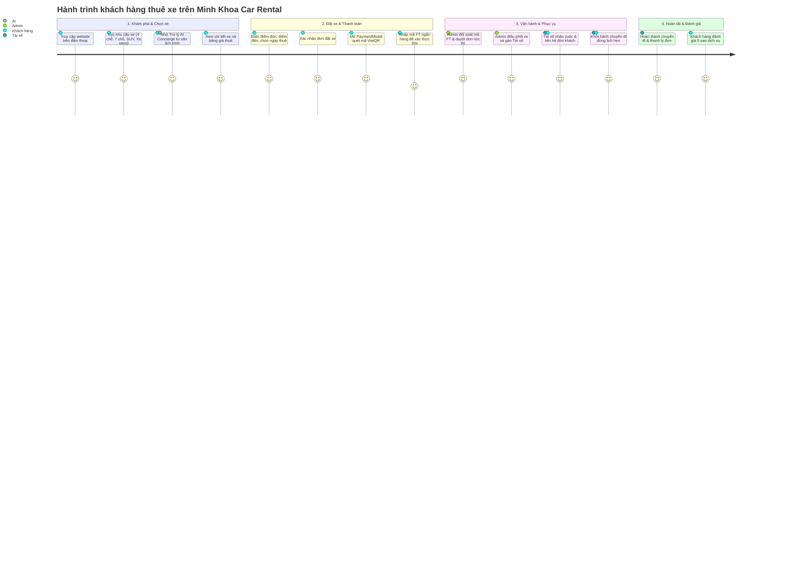

# 🚗 HỆ THỐNG THUÊ XE & ĐẶT XE DU LỊCH TRỰC TUYẾN MINH KHOA
### *(Minh Khoa Car Rental & Smart Booking Management System)*

<p align="center">
  
  
  
  
</p>

> 🌟 **Minh Khoa Car Rental** là nền tảng số hóa toàn diện dịch vụ vận tải hành khách và cho thuê xe du lịch cao cấp tại Việt Nam. Dự án được xây dựng theo tiêu chuẩn công nghệ hiện đại, kết nối liền mạch giữa **Khách hàng thuê xe**, **Đội ngũ tài xế chuyên nghiệp** và **Trung tâm điều hành quản trị đội xe** theo thời gian thực.

---

## 📖 1. Câu Chuyện & Bối Cảnh Hình Thành Dự Án

### 🛑 Thực trạng ngành thuê xe truyền thống
Tại Việt Nam, nhu cầu thuê xe ô tô tự lái, xe du lịch có tài xế, xe đưa đón sân bay và xe sự kiện tăng trưởng rất mạnh. Tuy nhiên, quy trình truyền thống vẫn tồn tại nhiều bất cập:
* **Thiếu minh bạch:** Khách hàng thường phải liên hệ qua điện thoại hoặc Zalo, giá cả không cố định, dễ phát sinh phụ phí ẩn.
* **Quy trình thủ công, rườm rà:** Xác nhận lịch xe, đặt cọc bằng chuyển khoản thủ công cần nhân viên túc trực kiểm tra sao kê ngân hàng rất tốn thời gian.
* **Trải nghiệm di động kém:** Nhiều website cũ trượt ngang lộn xộn, bố cục vỡ trên màn hình điện thoại, gây khó chịu cho khách hàng.
* **Nguy cơ gian lận thanh toán:** Tình trạng gửi ảnh chuyển khoản giả mạo (Fake Bill) hoặc spam yêu cầu đặt xe ảo gây thất thoát và gián đoạn vận hành.

### 💡 Giải pháp từ Minh Khoa Car Rental
Dự án được ra đời với mục tiêu **công nghệ hóa toàn bộ quy trình thuê xe**, mang phong cách hiện đại chuẩn mực tương tự các ứng dụng hàng đầu như Mioto hay Grab, nhưng được tùy biến sâu sắc cho thị trường vận tải Việt Nam:
1. **Minh bạch 100%:** Giá thuê niêm yết rõ ràng theo ngày, thông số xe, hình ảnh thực tế, tiện nghi đi kèm và đánh giá từ khách hàng trước.
2. **Trải nghiệm Mobile-First 1 cột:** Thiết kế mượt mà, trực quan, loại bỏ hoàn toàn thao tác cuộn ngang gây ức chế trên điện thoại.
3. **Trợ lý AI đồng hành:** Tự động lắng nghe và gợi ý xe theo đúng nhu cầu (số ghế, lịch trình, ngân sách).
4. **Thanh toán VietQR chuẩn Napas 24/7:** Tự động sinh mã QR theo đơn hàng, kèm lớp bảo mật ngầm bảo vệ doanh nghiệp trước các thủ đoạn gian lận.

---

## 🎯 2. Mục Tiêu & Giá Trị Cốt Lõi

```
                     ┌────────────────────────────────────────┐
                     │   MINH KHOA CAR RENTAL ECOSYSTEM       │
                     └───────────────────┬────────────────────┘
                                         │
         ┌───────────────────────────────┼───────────────────────────────┐
         ▼                               ▼                               ▼
┌──────────────────┐           ┌──────────────────┐           ┌──────────────────┐
│   KHÁCH HÀNG     │           │     TÀI XẾ       │           │   QUẢN TRỊ VIÊN  │
│   (CUSTOMER)     │           │    (DRIVER)      │           │     (ADMIN)      │
├──────────────────┤           ├──────────────────┤           ├──────────────────┤
│• Tìm & chọn xe   │           │• Cổng xe di động │           │• Quản lý đội xe  │
│• AI tư vấn       │◄─Realtime─►• Nhận cuốc tức thì│◄─Realtime─►• Phân bổ tài xế  │
│• Quét VietQR     │  Socket   │• Cập nhật lộ trình│  Socket   │• Đối soát mã FT  │
│• Quản lý chuyến  │           │• Báo sẵn sàng đón│           │• Báo cáo doanh thu│
└──────────────────┘           └──────────────────┘           └──────────────────┘
```

* **Nhanh chóng & Tiện lợi:** Đặt xe thành công chỉ trong vòng chưa đầy 2 phút.
* **An toàn tuyệt đối:** Mã hóa mật khẩu, phiên đăng nhập bảo mật JWT, bảo vệ giao dịch đa tầng với Redis.
* **Đồng bộ thời gian thực:** Trạng thái đơn hàng, xe và tài xế được cập nhật tức thì qua WebSocket mà không cần tải lại trang.

---

## ✨ 3. Những Điểm Sáng & Tính Năng Nổi Bật

### 📱 3.1. Giao Diện Người Dùng Đẳng Cấp (Luxury Mobile-First UI/UX)
* **Bố cục 1 cột duy nhất trên điện thoại:** Không chia 2 slide trượt ngang, khách hàng chỉ cần vuốt dọc tự nhiên để khám phá từ đầu đến cuối trang.
* **Thanh điều hướng Mobile Drawer sang trọng:**
  - Nhận diện người dùng thông minh: Hiển thị Avatar, Tên, Cấp bậc thành viên (VIP / Quản trị viên).
  - Lối tắt nhanh vào *Quản trị hệ thống* hoặc *Chuyến đi của tôi*.
  - Các mục điều hướng dạng thẻ bo tròn nhiều màu sắc trực quan.
  - Hotline hỗ trợ khẩn cấp **`0859 354 724`** nổi bật với nút gọi ngay 1-chạm.
* **Hiệu ứng mượt mà (Micro-Interactions):** Sử dụng các chuyển động tinh tế, thẻ xe đổ bóng mềm mại, huy hiệu trạng thái sống động.

---

### 🔍 3.2. Tìm Kiếm Xe Thông Minh & Bộ Lọc Nhu Cầu Nhanh (Quick Need Chips)
Khách hàng không cần phải nhập nhiều thông tin phức tạp, chỉ cần bấm chọn nhu cầu thực tế:
* 🚗 **Xe 4 chỗ đô thị:** Nhỏ gọn, tiết kiệm nhiên liệu, luồn lách phố xá linh hoạt (Vios, Accent, Mazda 3).
* 🚙 **Xe 7 chỗ gia đình:** Rộng rãi, êm ái cho các chuyến đi dã ngoại cuối tuần (Innova, Xpander, Veloz).
* 🏔️ **SUV gầm cao thể thao:** Động cơ mạnh mẽ, vượt mọi địa hình đồi dốc (Fortuner, Everest, SantaFe).
* ⭐ **Xe sang đối tác & Sự kiện:** Đẳng cấp đón tiếp khách VIP, hội nghị cao cấp (Camry, Mercedes-Benz, Carnival).
* 💰 **Xe tiết kiệm dưới 1 triệu/ngày:** Tối ưu chi phí cho các chuyến công tác ngắn ngày.

---

### 🤖 3.3. Trợ Lý Ảo AI Concierge (AI Assistant ✨)
* Được tích hợp sẵn ngay góc màn hình với biểu tượng vector tỏa sáng hiện đại.
* **Hiểu ngôn ngữ tự nhiên tiếng Việt:** Khách hàng có thể nhập câu hỏi như đang nhắn tin với nhân viên tư vấn:
  > *"Mình muốn thuê xe đưa gia đình 6 người đi Vũng Tàu 2 ngày cuối tuần, ngân sách tầm 1.5 triệu, nên chọn xe nào?"*
* **Tự động đối soát kho xe thực tế:** AI trích xuất dữ liệu xe có sẵn trong hệ thống và đưa ra câu trả lời gợi ý chính xác, kèm **thẻ xe trực quan** để khách ấn vào xem chi tiết hoặc đặt ngay.

---

### 💳 3.4. Hệ Thống Thanh Toán QR Chuẩn Quốc Gia (Napas 24/7)
Hỗ trợ đa dạng phương thức thanh toán trong một cửa sổ duy nhất (`PaymentModal`):
* **VietQR 24/7 (Ngân hàng Vietcombank):**
  - Tự động sinh mã QR động chuẩn hóa liên ngân hàng.
  - Nhúng sẵn Số tài khoản thụ hưởng: **`0859354724`**.
  - Tên thụ hưởng pháp nhân: **`CONG TY CO PHAN MINH KHOA`**.
  - Tự động điền số tiền chính xác theo từng đơn đặt và cú pháp chuẩn `MINHKHOA [MÃ_ĐƠN]`.
  - Khách có thể quét bằng app của bất kỳ ngân hàng nào tại Việt Nam (Vietcombank, BIDV, Techcombank, MB, ACB,...).
* **Ví điện tử MoMo & VNPAY-QR:** Dành cho khách hàng trẻ chuộng thanh toán ví điện tử một chạm.
* **Tiền mặt khi nhận xe (COD):** Dành cho khách hàng muốn nhận xe, kiểm tra chất lượng và ký hợp đồng giấy tờ trước khi thanh toán.
* **Tiện ích hỗ trợ khách:** Nút sao chép nhanh STK / Nội dung 1-chạm, nút tải mã QR về máy, đồng hồ đếm ngược 15 phút giữ xe.

---

### 🛡️ 3.5. Hệ Thống Bảo Mật Ngầm Đa Tầng (Anti-Fraud Multi-Layers)
Để ngăn chặn tình trạng gian lận, phá hoại hoặc spam đơn ảo, hệ thống đã triển khai 5 lớp bảo vệ ngầm:
1. **Redis Rate Limiting:** Giới hạn tối đa 5 yêu cầu gửi thanh toán trong vòng 5 phút trên mỗi tài khoản.
2. **Khóa Cooldown 30 giây:** Chống bấm đúp (double-click) hoặc spam nút thanh toán liên tục trên cùng một đơn hàng.
3. **Chống Replay Attack:** Xác thực dấu thời gian (`clientTimestamp`), từ chối các gói tin mạng bị bắt lén và gửi lại trễ quá 15 phút.
4. **Dấu vân tay thiết bị & Audit Log:** Thu thập `deviceFingerprint`, địa chỉ IP và User-Agent để ghi vết nhật ký an ninh.
5. **Đối soát mã FT ngân hàng 1-1:** Khách hàng cung cấp Mã giao dịch / Mã FT ngân hàng; giao diện Quản trị viên hiển thị nổi bật mã này để đối chiếu trực tiếp với sao kê Vietcombank trước khi duyệt đơn.

---

## 👥 4. Các Phân Hệ & Vai Trò Trong Dự Án

### 4.1. Phân Hệ Khách Hàng (Customer Portal)
* Xem danh mục xe phong phú kèm bộ lọc đa tiêu chí (hãng xe, số ghế, mức giá, loại xe).
* Xem trang chi tiết xe: Đầy đủ ảnh xe, mô tả tiện nghi, tính năng an toàn, bảng giá thuê niêm yết.
* Đặt xe nhanh chóng: Chọn ngày bắt đầu, ngày kết thúc, điểm đón và điểm đến mong muốn.
* Quản lý chuyến đi cá nhân: Theo dõi trạng thái đơn (Chờ duyệt, Đã xác nhận, Đã phân xe, Tài xế đang đón, Hoàn thành).
* Đánh giá chất lượng dịch vụ: Chấm điểm từ 1 đến 5 sao và viết nhận xét thực tế sau mỗi chuyến đi.

### 4.2. Phân Hệ Tài Xế (Driver Portal - `/driver`)
* Được thiết kế tối ưu riêng cho thao tác trên điện thoại của tài xế khi đang làm việc.
* Tiếp nhận chuyến đi được trung tâm điều hành bàn giao qua thông báo thời gian thực.
* Cập nhật các mốc hành trình: *Đã nhận cuốc* ➔ *Đang di chuyển đón khách* ➔ *Hoàn thành chuyến đi*.
* Bật/tắt chế độ làm việc: *Sẵn sàng nhận khách* (`AVAILABLE`) hoặc *Nghỉ ca* (`OFF_DUTY`).

### 4.3. Phân Hệ Quản Trị Viên (Admin Management - `/admin`)
* **Tổng quan kinh doanh (Dashboard KPI):** Thống kê tổng doanh thu thực tế, số xe đang chạy, số xe rảnh và các đơn chờ xử lý.
* **Quản trị đội xe (Fleet Management):**
  - Thêm xe mới vào đội ngũ (Tải ảnh xe, biển số, loại xe, đời xe, giá thuê).
  - Chỉnh sửa thông tin xe hoặc cập nhật giá thuê linh hoạt theo mùa lễ hội.
  - Chuyển đổi trạng thái xe linh hoạt (Sẵn sàng, Đang thuê, Bảo dưỡng định kỳ).
  - Xóa xe không còn khai thác.
* **Quản lý đơn đặt & điều phối:** Duyệt đơn đặt xe, chỉ định xe cụ thể trong bãi và phân công tài xế phụ trách.
* **Quản lý thanh toán & doanh thu:** Nhận chuông báo thời gian thực khi có khách chuyển khoản, kiểm tra mã FT và ấn xác nhận đã thu tiền.

---

## 🗺️ 5. Hành Trình Trải Nghiệm Của Khách Hàng



---

## 💻 6. Ngăn Xếp Công Nghệ Đột Phá (Modern Tech Stack)

| Hạng mục | Công nghệ | Vai trò & Lý do lựa chọn |
| :--- | :--- | :--- |
| **Giao diện (Frontend)** | **Next.js 16 (App Router)** | Render Server & Client hiệu năng cao với trình biên dịch Turbopack, chuẩn hóa SEO |
| | **React 19 & TypeScript** | Nền tảng UI hiện đại nhất, kiểm soát kiểu dữ liệu an toàn (Type Safety) |
| | **Tailwind CSS & CSS Mod** | Hệ thống màu Emerald sang trọng, bố cục linh hoạt, tải trang siêu nhanh |
| | **Zustand** | Quản lý State phiên đăng nhập nhẹ nhàng, đồng bộ LocalStorage chống mất phiên khi F5 |
| | **Framer Motion & Lucide** | Hiệu ứng vi chuyển động mượt mà, bộ icon vector đồng bộ sắc nét |
| | **Socket.IO Client** | Lắng nghe tín hiệu cập nhật đơn hàng và thông báo thời gian thực |
| **Máy chủ (Backend)** | **Node.js & Express.js** | Nền tảng máy chủ hướng sự kiện, kiến trúc module phân tầng sạch sẽ |
| | **Prisma ORM** | Tương tác CSDL kiểu mẫu, tự động hóa Migration và nạp dữ liệu mẫu an toàn |
| | **PostgreSQL 16** | Cơ sở dữ liệu quan hệ mạnh mẽ, đảm bảo tính toàn vẹn dữ liệu chuẩn ACID |
| | **Redis 7** | Bộ nhớ đệm tốc độ cao, xử lý Rate Limiting và khóa Cooldown bảo vệ hệ thống |
| | **Socket.IO Server** | Điều phối kết nối WebSocket thời gian thực giữa Khách hàng, Tài xế và Admin |
| | **JWT & Bcrypt** | Xác thực Token không trạng thái (Stateless), băm mật khẩu chuẩn Salt 10 vòng |
| **Hạ tầng (DevOps)** | **Docker & Compose** | Đóng gói môi trường CSDL và Cache trong container, khởi chạy chỉ với 1 dòng lệnh |

---

## 🔑 7. Dữ Liệu Demo & Tài Khoản Kiểm Thử

Dự án đã được tích hợp sẵn bộ dữ liệu mẫu (Seed Data) hoàn chỉnh để sẵn sàng thuyết trình hoặc kiểm thử tính năng:

| Vai trò | Email đăng nhập | Mật khẩu mặc định | Đường dẫn kiểm thử |
| :--- | :--- | :--- | :--- |
| **👑 Quản trị viên (Admin)** | `giolaptrinh@gmail.com` | `giolaptrinh123` | [`/admin`](http://localhost:3000/admin) |
| **🧑‍💼 Khách hàng (Customer)** | `customer@minhkhoa.com` | `customer123` | [`/bookings`](http://localhost:3000/bookings) |
| **🚗 Tài xế (Driver)** | `driver@minhkhoa.com` | `driver123` | [`/driver`](http://localhost:3000/driver) |

### 🏦 Thông tin tài khoản thụ hưởng & Hotline:
* **Ngân hàng:** Vietcombank (Chi nhánh TP. Hồ Chí Minh)
* **Số tài khoản:** **`0859354724`**
* **Chủ tài khoản:** **`CONG TY CO PHAN MINH KHOA`**
* **Hotline hỗ trợ 24/7:** **`0859 354 724`**

---

## 🚀 8. Hướng Dẫn Cài Đặt Nhanh (Quick Start)

Chỉ với 3 bước đơn giản để khởi chạy toàn bộ hệ sinh thái trên máy tính cá nhân:

### Bước 1: Khởi động CSDL PostgreSQL & Redis bằng Docker
Mở Terminal tại thư mục gốc dự án:
```bash
docker compose up -d
```

### Bước 2: Khởi động máy chủ Backend API
Mở cửa sổ Terminal thứ hai:
```bash
cd backend
npm install
npx prisma migrate dev --name init
npx ts-node prisma/seed.ts
npm run dev
```
> Máy chủ API & WebSocket sẽ hoạt động tại: **`http://localhost:4000`**

### Bước 3: Khởi động ứng dụng giao diện Frontend
Mở cửa sổ Terminal thứ ba:
```bash
cd frontend
npm install
npm run dev
```
> Ứng dụng Web sẽ mở tại: **`http://localhost:3000`**

---

## 🔮 9. Định Hướng Phát Triển Tương Lai (Roadmap)

* [ ] **Định vị xe thời gian thực (Live GPS Tracking):** Tích hợp bản đồ trực tuyến giúp khách hàng theo dõi vị trí xe của tài xế đang di chuyển đón mình theo thời gian thực.
* [ ] **Ứng dụng di động chuyên biệt (Native Mobile Apps):** Phát triển ứng dụng trên iOS và Android với Flutter hoặc React Native.
* [ ] **Cơ chế hợp đồng số (E-Contract & E-Sign):** Khách hàng và nhà xe có thể ký hợp đồng thuê xe điện tử có giá trị pháp lý ngay trên điện thoại.
* [ ] **Mở rộng sàn P2P Car Sharing:** Cho phép các chủ xe tư nhân đăng ký liên kết xe nhàn rỗi để tạo nguồn thu nhập thụ động.

---

## 👨‍💻 10. Đơn Vị Phát Triển & Bản Quyền

* **Đơn vị phát triển:** **Minh Khoa Car Rental & Travel Ecosystem**
* **Quản trị viên hệ thống:** **Quản trị viên Gió Lập Trình** (`giolaptrinh@gmail.com`)
* **Tổng đài chăm sóc khách hàng:** **`0859 354 724`** *(Hỗ trợ 24/7/365)*
* **Bản quyền sở hữu:** © 2026 Minh Khoa Car Rental System. All rights reserved.